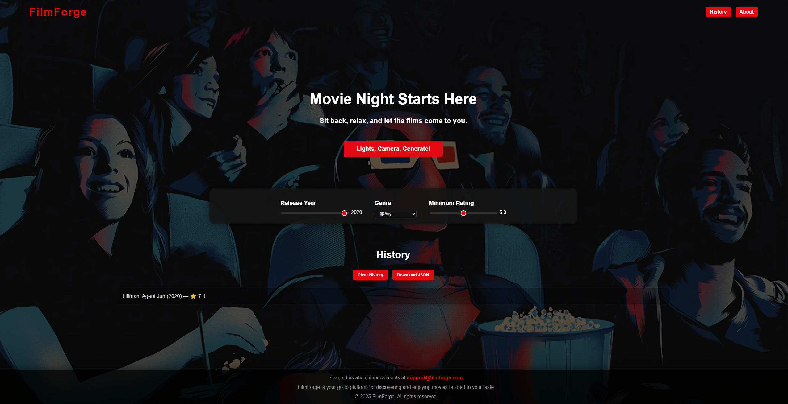
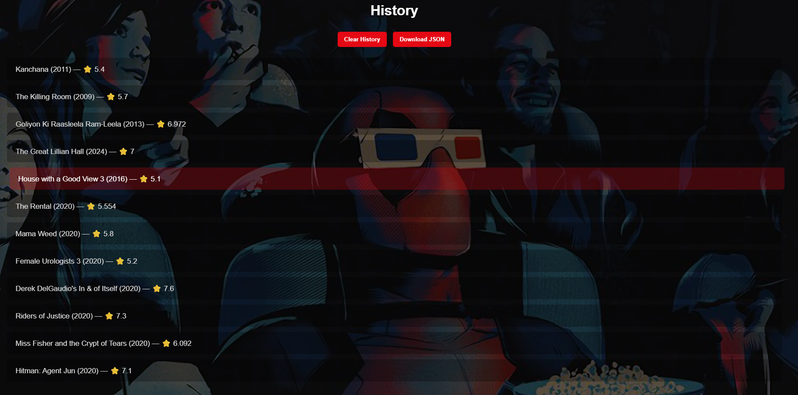

# 🎬 FilmForge

FilmForge is a single-page web application that generates film recommendations based on user-selected filters such as genre, release year, and rating.

## 🚀 Features
- Filter movies by genre
- Filter by release year
- Filter by rating
- Dynamic updates without page reload (SPA)
- Integration with TMDB API
- View trailers

## 🛠️ Technologies Used
- HTML
- CSS
- JavaScript
- TMDB API

## ▶️ How to Run
1. Download or clone the repository
2. Open `index.html` in your browser

## 📸 Screenshots

### Home Page

### Movie Result

### History Section

## 📚 Project Purpose
Developed as part of COMP1004 coursework.
